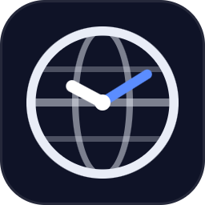
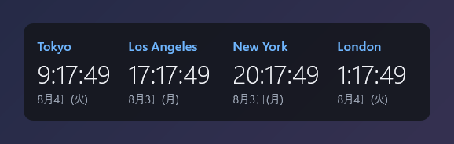
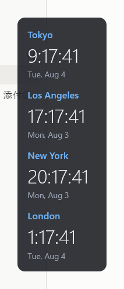
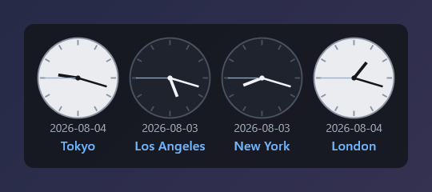
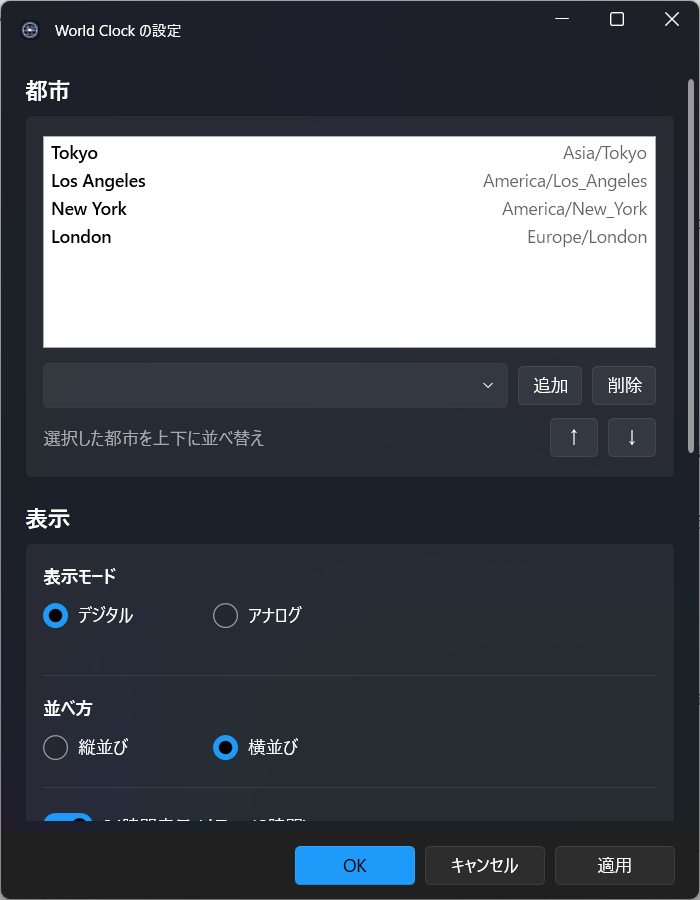

<div align="center">



# World Clock Gadget

**複数のタイムゾーンをデスクトップに常駐表示する、軽量な Windows ガジェット**

Windows 7 のデスクトップガジェット風。半透明パネルに世界各都市の時刻を並べ、
DST（サマータイム）も自動で正確に追従します。

[English](README.en.md) · [インストール](#インストール) · [使い方](#使い方) · [設定](#設定) · [ビルド](#ソースからビルドする)



</div>

---

## 特長

- 🌍 **複数都市を同時表示** — IANA タイムゾーンで管理し、**DST を自動追従**（毎tick再計算）
- 🕘 **デジタル / アナログ** 表示 — アナログは**午前=白い文字盤 / 午後=黒い文字盤**で昼夜が一目瞭然
- ↔️ **縦並び / 横並び** レイアウト
- 📅 **日付の書式を自由に指定** — `2026年8月4日 (火)` から `2026-08-04` まで
- 🪶 **軽量常駐** — 常駐プロセスは C++/Win32/Direct2D 製（exe 400KB・.NET 不要）
- 🎨 **半透明・フレームレス** — ドラッグで移動、不透明度をスライダーで調整
- 🪟 **覆われ得る常駐** — 既定では最前面固定にせず、タスクバー・Alt-Tab にも出ない
- ⚙️ **Windows 11 風の設定アプリ** — Fluent デザイン、OK / キャンセル / 適用
- 🚀 **Windows 起動時の自動開始**（管理者権限不要）

<div align="center">

&nbsp;&nbsp;

</div>

---

## インストール

### インストーラー（推奨）

1. **[Releases から `WorldClockGadget-Setup.exe` をダウンロード](../../releases/latest)**
2. ダブルクリックして実行

それだけです。以下の点にご注意ください。

- **管理者権限は不要**です（`%LOCALAPPDATA%\Programs\WorldClockGadget` にユーザー単位でインストール）
- **.NET のインストールは不要**です（設定アプリにランタイムを同梱）
- インストール中に「デスクトップアイコンの作成」「Windows 起動時に自動的に開始」を選べます

> [!NOTE]
> 署名されていない個人開発アプリのため、初回起動時に **Microsoft Defender SmartScreen** の
> 警告が出ることがあります。その場合は「詳細情報」→「実行」で進めてください。

### 動作環境

| 項目 | 要件 |
|---|---|
| OS | Windows 10 (1809+) / **Windows 11 推奨** |
| アーキテクチャ | x64 |
| ランタイム | **不要**（本体は依存なし・設定アプリは .NET 同梱） |

> Windows 11 22H2 以降では設定アプリに Mica（すりガラス）効果が適用されます。
> Windows 10 では通常の背景で描画されます（機能は同じ）。

### アンインストール

次のいずれからでも実行できます。

1. **設定 > アプリ > インストールされているアプリ** の「World Clock Gadget」
2. **スタートメニュー** の「World Clock Gadget をアンインストールする」
3. インストールフォルダの `unins000.exe`

実行中でも自動的にアプリを終了して削除します。最後に**設定ファイルを残すか削除するか**
確認するので、「いいえ」を選べば再インストール時に都市や表示設定がそのまま復元されます。

---

## 使い方

| 操作 | 動作 |
|---|---|
| **ドラッグ** | ガジェットを移動（位置は自動保存され、次回起動時に復元） |
| **右クリック** | メニュー：設定… / 常に最前面 / 位置を固定 / 終了 |

既定では**他のウィンドウに覆われる**ようになっています（Windows 7 の純正ガジェットと同じ挙動）。
常に見えるようにしたい場合は、右クリックメニューまたは設定から「常に最前面」を有効にしてください。

タスクバーや Alt-Tab には表示されません。終了するには右クリック →「終了」を使います。

---

## 設定

ガジェットを**右クリック → 「設定…」** で設定アプリが開きます。

<div align="center">

</div>

### ボタンの動作

設定はファイルに保存され、ガジェットがそれを監視して即座に反映します。
そのため「適用」＝「保存」＝「反映」が同時に起こります。

| ボタン | 動作 |
|---|---|
| **OK** | 保存してガジェットに反映し、ウィンドウを閉じる |
| **キャンセル** | 保存せずに閉じる（適用済みの変更は確定済み） |
| **適用** | 保存してガジェットに反映するが、閉じない |

不透明度やサイズを調整 → **適用** → 実際の見た目を確認 → 微調整、という流れで
プレビューのように使えます。

### 設定できる項目

- **都市** … 追加・削除・並べ替え。主要都市の一覧から選ぶか、IANA 名（例 `Asia/Tokyo`）を直接入力
- **表示モード** … デジタル / アナログ
- **並べ方** … 縦並び / 横並び
- **12/24時間表示**、**日付・曜日の表示**、**秒の表示**
- **日付の書式** … プリセット＋自由入力（下記）
- **サイズ** … 小 / 中 / 大
- **不透明度** … 10〜100%
- **常に最前面**、**位置を固定**、**Windows 起動時に自動的に開始**

### 日付の書式

設定アプリのプリセットから選べるほか、独自の書式も入力できます（ライブプレビュー付き）。

| トークン | 意味 | 例 |
|---|---|---|
| `yyyy` / `yy` | 年（4桁 / 2桁） | `2026` / `26` |
| `MMMM` / `MMM` | 月名（英語フル / 略） | `August` / `Aug` |
| `MM` / `M` | 月（2桁 / 数値） | `08` / `8` |
| `dddd` / `ddd` | 曜日（英語フル / 略） | `Tuesday` / `Tue` |
| `dd` / `d` | 日（2桁 / 数値） | `04` / `4` |
| `aaaa` / `aaa` | 日本語の曜日 | `火曜日` / `火` |

上記以外の文字（`年` `月` `日` `/` `-` 空白など）はそのまま表示されます。

```
"yyyy年M月d日 (aaa)"  →  2026年8月4日 (火)
"ddd, MMM d"          →  Tue, Aug 4
"yyyy-MM-dd"          →  2026-08-04
```

### 設定ファイルの場所

`%APPDATA%\WorldClockGadget\` に保存されます。手で編集しても即座に反映されます。

```jsonc
// config.json — 設定アプリが所有
{
  "cities": [
    { "label": "Tokyo",    "tz": "Asia/Tokyo" },
    { "label": "New York", "tz": "America/New_York" }
  ],
  "displayMode": "digital",   // "digital" | "analog"
  "layout": "vertical",       // "vertical" | "horizontal"
  "hourFormat": 24,           // 12 | 24
  "showDate": true,
  "dateFormat": "ddd, MMM d",
  "showSeconds": false,
  "size": "medium",           // "small" | "medium" | "large"
  "opacity": 85,              // 0-100
  "alwaysOnTop": false,
  "lockPosition": false,
  "launchAtStartup": false,
  "theme": "dark"
}
```

`state.json` にはウィンドウ位置が保存されます（ガジェット本体が所有）。

---

## ソースからビルドする

### 必要なもの

- **Visual Studio 2022 / 2026** — C++ デスクトップ開発ワークロード（MSVC v14.3x 以降、Windows SDK）
- **[.NET 8 SDK](https://dotnet.microsoft.com/download/dotnet/8.0)** — `winget install Microsoft.DotNet.SDK.8`
- **[Inno Setup 6](https://jrsoftware.org/isdl.php)**（インストーラーを作る場合のみ）— `winget install JRSoftware.InnoSetup`

### ビルド

```bat
build_all.cmd
```

`dist\` に両方の実行ファイルが並んで出力されます（この配置により、ガジェットの
「設定…」メニューから設定アプリを起動できます）。

```bat
make_installer.cmd
```

`dist_installer\WorldClockGadget-Setup.exe` を生成します（単一ファイル、約50MB）。

個別にビルドする場合:

```bat
build_clock.cmd                        REM C++ ガジェット本体のみ
dotnet build src\settings -c Release   REM 設定アプリのみ
```

---

## アーキテクチャ

**意図的に2プロセス構成**を採っています。これは本プロジェクトの中核的な設計判断です。

| コンポーネント | 技術 | 役割 | 常駐 |
|---|---|---|---|
| **WorldClockGadget** | C++20 / Win32 / Direct2D / DirectWrite | 時計を描画して常駐する唯一のプロセス | ○ |
| **WorldClockSettings** | C# / .NET 8 / WPF + [WPF-UI](https://github.com/lepoco/wpfui) | 設定を編集。閉じたら終了 | × |

### なぜ分けるのか

「常時の消費を最小に」と「Windows 11 設定アプリ級のモダンな見た目」は、
同一フレームワーク内では両立しません。前者は生の C++/Win32 を、後者は WinUI/Fluent 系を要求します。

常駐するのは本体だけなので、**本体を軽量な C++ に保ち、モダンな UI は「たまに開く別プロセス」に
隔離する**ことで両立させています。設定アプリは開いている間だけ数十MBを使いますが、
それは常駐コストには乗りません。

### プロセス間の連携

高速な IPC は持たず、**ファイル経由**で連携します。

```
設定アプリ ──書き込み──> config.json ──ファイル監視──> ガジェット本体（再読込・即反映）
ガジェット本体 ──書き込み──> state.json（ウィンドウ位置）
```

書き手が競合しないよう、**ファイルを役割で分離**しています（`config.json` は設定アプリが、
`state.json` は本体が所有）。設定アプリは一時ファイル経由の**アトミックな書き込み**を行い、
本体は `ReadDirectoryChangesW` で変更を検知します。

### 実装上のポイント

- **半透明・丸角・滑らかな縁** — Direct2D を **WIC の事前乗算 BGRA ビットマップ**に描画し、
  `UpdateLayeredWindow` で per-pixel alpha 合成。
  （`ID2D1DCRenderTarget` + GDI DC 経由だと**アルファが失われて全透明になる**ため WIC を挟んでいます）
- **DST の正確性** — 固定オフセットを持たず、IANA 識別子と C++20 `std::chrono::zoned_time` で
  **毎tick UTC から再計算**。これにより DST 切替も自動的に正しくなります
- **レイアウトの安定性** — テキスト幅は「最も広い数字」で測定するため、
  秒が進んでもパネル幅がガタつきません
- **Per-Monitor DPI v2** — 本体・設定アプリとも対応
- **更新間隔** — 既定は分単位（`showSeconds` が真のときのみ毎秒）で CPU 負荷を最小化
- **静的CRT リンク** — 動的CRT だと配布先に VC++ 再頒布可能パッケージ（**管理者権限が必要**）が
  要るため、`/MT` で静的リンクして依存をなくしています

### プロジェクト構成

```
src/clock/                  C++ ガジェット本体
  main.cpp                    エントリポイント（wWinMain のみ）
  GadgetWindow.{hpp,cpp}      ウィンドウ・メニュー・ドラッグ・タイマー・ファイル監視
  Renderer.{hpp,cpp}          Direct2D 描画（デジタル / アナログ）
  TimeEngine.{hpp,cpp}        IANA タイムゾーン / DST 計算
  Config.{hpp,cpp}            config.json / state.json の読み書き
  Startup.{hpp,cpp}           自動起動の登録・解除
  json.hpp                    依存なしの最小 JSON パーサ
src/settings/               C# WPF 設定アプリ
installer/                  Inno Setup スクリプト
icons/                      アプリアイコン
```

---

## 今後の予定

必要に応じて追加を検討している機能です。

- [ ] 色・テーマのカスタマイズ（現在は「暗い半透明＋明色テキスト」の1テーマ）
- [ ] ガジェットの複数インスタンス（現在は1パネルに複数都市）
- [ ] 設定の「元に戻す」（開いた時点のスナップショットに戻す）

## ライセンス

[MIT License](LICENSE) © 2026 Kaito Ito

アイコンは [Claude](https://claude.ai) Design により作成されました。
